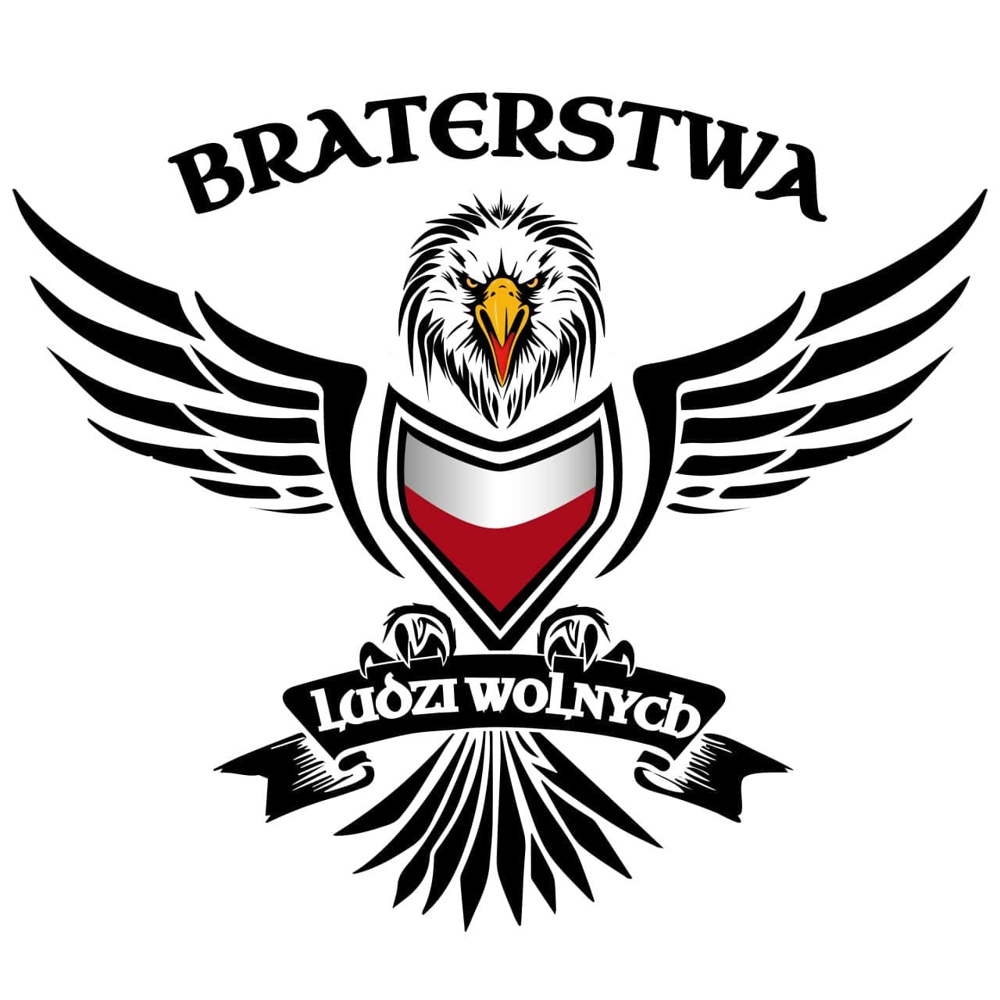
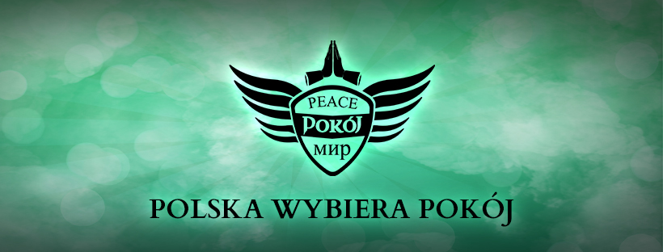

# Raport Analizy Ogólnej: Braterstwa Ludzi Wolnych

**Data analizy:** 2025-11-26
**Podmiot:** Braterstwa Ludzi Wolnych (BLW)
**Typ:** Organizacja / Ruch Społeczny
**Strona WWW:** BRATERSTWA.PL (zidentyfikowana w postach)

## 1. Profil i Autoprezentacja

Na podstawie analizy treści postów i komunikatów organizacji, Braterstwa Ludzi Wolnych prezentują się jako ruch oddolny skupiony na:

### A. Misja i Cele
*   **Samowystarczalność (Survivalizm):** Organizacja kładzie silny nacisk na niezależność od systemu, promując uprawę własnej żywności ("#Ogród", "#Samowystarczalność") i przygotowania na nadchodzący kryzys ("Jak zacznie się cyrk będziemy gotowi!").
*   **Budowa "Nowej Ziemi":** Używają języka utopijnego/eschatologicznego, wzywając do "zbudowania naszej wolnej nowej ziemi". Sugeruje to dążenie do stworzenia alternatywnego społeczeństwa obok istniejących struktur państwowych.
*   **Narracja Oblężonej Twierdzy:** Przedstawiają się jako ofiary represji politycznych. W postach wspominają o nalotach ABW (Agencji Bezpieczeństwa Wewnętrznego) na polecenie prokuratury, szukających dowodów na "zamach stanu". Buduje to tożsamość męczenników walczących z "systemem".

### B. Kanały Komunikacji i Organizacja
*   **Media:** Ścisła współpraca z telewizją internetową **PL1.TV** (częste udostępnienia, wywiady, materiały wideo).
*   **Rekrutacja:** Proces rekrutacji odbywa się m.in. przez platformę **Discord**, co sugeruje chęć utrzymania wewnętrznej komunikacji poza głównym nurtu mediów społecznościowych.
*   **Wydarzenia:** Organizują cykliczne zloty, np. "Spotkanie Rodzin Po Bratersku", które służą integracji środowiska.

## 2. Analiza Wizualna (Symbolika)

### A. Logo Główne (Orzeł)
1.  **Orzeł:**
    *   Stylizowany, agresywny wizerunek orła z rozpostartymi skrzydłami.
    *   Nawiązuje do godła Polski, ale pozbawiony jest korony (co może sugerować nawiązania do PRL lub specyficzną interpretację "ludową").
    *   Stylistyka przypomina logotypy klubów motocyklowych lub grup paramilitarnych.
2.  **Tarcza:**
    *   W centralnym punkcie tarcza w barwach narodowych (biel i czerwień).
3.  **Typografia:**
    *   Napis "BRATERSTWA LUDZI WOLNYCH" wykonany stylizowaną czcionką, nawiązującą do estetyki historycznej/słowiańskiej.

### B. Grafika "Polska Wybiera Pokój"
1.  **Hasło "PEACE POKÓJ МИР":**
    *   Trójjęzyczny napis na tarczy: angielski, polski i **rosyjski**.
    *   Użycie języka rosyjskiego ("МИР") w kontekście wojny na Ukrainie jest silnym sygnałem politycznym, często kojarzonym z narracją "anty-wojenną" promowaną przez Kreml (wezwania do kapitulacji Ukrainy pod płaszczykiem pokoju).
2.  **Symbolika Dłoni/Skrzydeł:**
    *   Nad tarczą widoczne dłonie złożone jak do modlitwy lub skute kajdankami (niejednoznaczne), otoczone skrzydłami.
3.  **Hasło Dolne:**
    *   "POLSKA WYBIERA POKÓJ" – popularny slogan w środowiskach sprzeciwiających się pomocy militarnej dla Ukrainy.

## 3. Wnioski Interpretacyjne

*   **Profil Ideologiczny:** Organizacja łączy estetykę patriotyczną/nacjonalistyczną (orzeł, barwy narodowe) z narracjami pacyfistycznymi o zabarwieniu prorosyjskim oraz elementami survivalizmu/preppingu.
*   **Profil Odbiorcy:** Osoby o poglądach patriotycznych, ale sceptyczne wobec głównego nurtu polityki zagranicznej, podatne na narracje o "suwerenności", "pokoju za wszelką cenę" oraz obawiające się globalnego kryzysu.
*   **Wektor Propagandy:**
    *   Wykorzystanie symboli narodowych do legitymizacji działań anty-systemowych.
    *   Promowanie hasła "MIR" (pokój) w cyrylicy jako próba ocieplania wizerunku Rosji.
    *   Budowanie nieufności wobec instytucji państwowych (ABW, prokuratura) poprzez narrację o prześladowaniach.

## 4. Powiązania w Grafie

*   **Organizacja:** `Braterstwa Ludzi Wolnych`
*   **Symbol:** `Logo: Orzeł BLW`
*   **Symbol:** `Grafika: Peace-Pokój-Mir`
*   **Media:** `PL1.TV` (współpraca/promocja)
*   **Relacja:** `Braterstwa Ludzi Wolnych` -[`USES_SYMBOL`]-> `Logo: Orzeł BLW`
*   **Relacja:** `Braterstwa Ludzi Wolnych` -[`USES_SYMBOL`]-> `Grafika: Peace-Pokój-Mir`
*   **Relacja:** `Braterstwa Ludzi Wolnych` -[`COLLABORATES_WITH`]-> `PL1.TV` (do dodania/weryfikacji w grafie)

## 5. Zrzuty Ekranu (Referencje)

